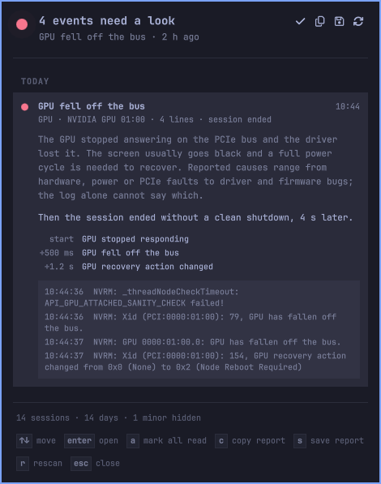
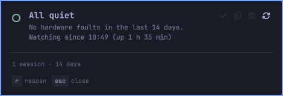
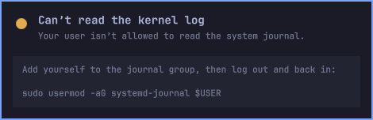
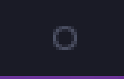
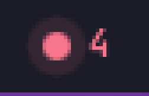

# OmaBlackbox

**A flight recorder for your hardware, in the Omarchy bar.**

When a GPU falls off the PCIe bus, a drive stops answering, or the machine simply
dies, the evidence is in the kernel log, buried under tens of thousands of lines
and gone from your screen by the time you look. OmaBlackbox watches that log for
you. It shows one quiet dot in the bar, lights it when something needs a look,
explains each event in plain English, and remembers how your *last* session ended,
which is usually the moment you most want to know about.

<p align="center">
  
</p>

<table align="center">
  <tr>
    <td align="center"><br><sub>All quiet</sub></td>
    <td align="center"><br><sub>Can't read the log (with the fix)</sub></td>
  </tr>
  <tr>
    <td align="center"><br><sub>In the bar: quiet</sub></td>
    <td align="center"><br><sub>In the bar: needs a look</sub></td>
  </tr>
</table>

<sub>Screenshots use the built-in preview mode (sample events), not real machine data.</sub>

## What you get

- **A single dot in the bar.** A hollow ring when all is quiet; a filled dot in
  the severity colour (with a count) when something needs attention. It follows
  your Omarchy theme.
- **Faults decoded, not dumped.** NVIDIA Xid codes, AMD and Intel GPU hangs, PCIe
  errors, machine-check and ECC memory errors, NVMe and SATA failures, filesystem
  errors, USB and Wi-Fi firmware crashes, thermal throttling, kernel panics and
  more. Each one gets a title, a severity and a short explanation. See
  [`docs/DETECTORS.md`](docs/DETECTORS.md) for the full list.
- **One event, not forty.** A real failure is a cascade of log lines. OmaBlackbox
  folds them into a single incident with the sequence of what happened and a few
  representative lines.
- **"Session ended without a clean shutdown."** After a freeze, hard reset or
  crash the desktop is gone, so the log is the only witness. OmaBlackbox notices
  the tell-tale missing shutdown sequence and, if a critical fault came just
  before it, joins the two into one story. It also sends a notification the next
  time you log in.
- **A report you can paste.** One key copies a Markdown report for a bug report or
  forum post, with MAC and IP addresses, UUIDs, serial numbers and home paths
  masked automatically.

## Install

```bash
omarchy plugin add https://github.com/rclinux/omablackbox --enable
```

That clones the plugin into `~/.config/omarchy/plugins/`, checks the manifest and
places the widget on the right of your bar. Move it with `omarchy bar move
io.github.rclinux.omablackbox --section left`.

Plugins run inside the Omarchy shell with your user's permissions. OmaBlackbox is
read-only by design and small enough to review: everything it runs is listed
under [Privacy and safety](#privacy-and-safety).

**Requirements:** Omarchy with the Quattro shell (developed on Omarchy 4.0),
systemd's journal (`journalctl`), and your user allowed to read it (the default on
Omarchy). `notify-send` and `wl-copy` are optional: notifications and the copy
button use them.

## Using it

Click the dot to open the panel. Enter (or a click) expands an incident. The keys
that work at that moment are always shown along the bottom of the panel, and every
key has a button at the top as well.

| Key | Action |
|---|---|
| `↑` `↓` or `j` `k` | Move between incidents |
| `Enter` or `Space` | Expand or collapse |
| `a` | Mark everything read |
| `c` | Copy the report (identifiers masked) |
| `s` | Save the report to a file (prints the path in the panel) |
| `r` | Rescan the journal |
| `Esc` | Close |

**From the command line or a keybinding:**

```bash
omarchy-shell omablackbox status        # one line of JSON: health, counts, follower state
omarchy-shell omablackbox acknowledge   # mark all read
omarchy-shell omablackbox copy          # copy the report to the clipboard
omarchy-shell omablackbox save          # save the report; prints the path
omarchy-shell omablackbox refresh       # rescan
omarchy-shell shell toggle io.github.rclinux.omablackbox '{}'   # open/close the panel
```

`status` is also the first thing to paste into a bug report.

## Settings

Settings live on the widget's entry in `~/.config/omarchy/shell.json` and reload on
save, for example:

```json
{ "id": "io.github.rclinux.omablackbox", "minSeverity": "notice", "scanDays": 30 }
```

| Setting | Default | What it does |
|---|---|---|
| `minSeverity` | `warning` | Lowest severity to list: `notice`, `warning` or `critical`. `notice` adds corrected PCIe errors and kernel warnings, which are usually harmless. |
| `scanDays` | `14` | How far back to look in the journal. |
| `maxBoots` | `30` | Most sessions to scan. Finished sessions are cached, so this is cheap. |
| `notify` | `true` | Announce a new critical event, and a recent session that ended without a clean shutdown. |
| `redact` | `true` | Mask identifiers in the panel and in reports. |
| `showWhenClear` | `true` | Keep the ring visible when there is nothing to report. |
| `animate` | `true` | Pulse gently on critical events. |
| `preview` | `off` | Show sample events, an all-quiet state, or the can't-read-the-log state, to see how the plugin looks. Reads and saves nothing. |

## Privacy and safety

OmaBlackbox is designed to be boring to audit.

- **Local only.** It makes no network connections and sends no telemetry.
- **Read-only.** It never writes to the system and needs no privileges. The
  only programs it runs are `journalctl`, `nice`, `uname`, `omarchy version`,
  `mkdir`, and optionally `notify-send` and `wl-copy`, plus `sh` for three tiny
  wrappers. Commands are fixed argument lists, and nothing read from the journal
  is ever placed in a command line.
- **One folder.** It keeps a small state file (which incidents you have marked
  read, and a cache of finished sessions) in `~/.local/state/omablackbox/`,
  created private to your user. Copying or saving a report writes there too.
- **Identifiers masked.** MAC and IP addresses, UUIDs (including GPU UUIDs),
  serial numbers, e-mail addresses, home paths and disk ids are masked in the
  panel and in reports. This is best effort: **read a report before posting it
  publicly.**
- **Light on the desktop.** History scans run at the lowest CPU priority, are
  capped, and a flood of log lines (a dying GPU driver can write millions) is
  rate-limited. See [`docs/HOW-IT-WORKS.md`](docs/HOW-IT-WORKS.md).

**Removal:**

```bash
omarchy plugin remove io.github.rclinux.omablackbox
rm -r ~/.local/state/omablackbox      # optional: its saved state and reports
```

## Troubleshooting

**"Can't read the kernel log."** Your user isn't allowed to read the system
journal. Add yourself to the `systemd-journal` group and log in again:

```bash
sudo usermod -aG systemd-journal $USER
```

**"Earlier sessions aren't kept in the journal."** Only the current session is
in the journal, so OmaBlackbox cannot see how earlier ones ended. To keep the
journal across reboots, make it persistent:

```bash
sudo mkdir -p /var/log/journal && sudo systemd-tmpfiles --create --prefix /var/log/journal
```

**Nothing shows up, and I expected something.** The detectors are conservative
and look for specific kernel messages. If the kernel logged a fault they miss,
open an issue with the relevant lines from `journalctl -k` (mask identifiers
first).

## Limits, honestly

- OmaBlackbox reports what the kernel *logged*. It cannot tell you *why* a GPU
  fell off the bus or why a session ended; it gives you the sequence and the
  timing, and the report makes them easy to share.
- A fault that crashes the machine before the kernel can write anything leaves no
  line to decode. The "session ended without a clean shutdown" note is exactly
  for that case.
- The interface is in English.

## Development

```bash
npm test                    # unit tests; no dependencies (uses Node's built-in runner)
./scripts/dev-install.sh    # copy into ~/.config/omarchy/plugins/ and rescan
omarchy plugin validate .   # check the manifest
```

The logic lives in pure JavaScript under `lib/` and is tested against synthetic
log lines; the QML files are a thin layer over it. Editing a `lib/*.js` file
needs `omarchy restart shell` (QML caches library scripts). See
[`docs/HOW-IT-WORKS.md`](docs/HOW-IT-WORKS.md) for the design and the
measurements behind it.

## License

MIT. See [`LICENSE`](LICENSE).
